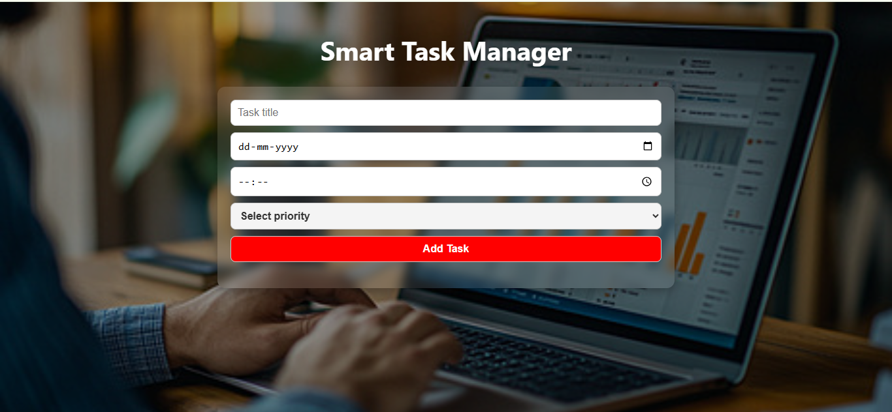

🌟 Smart Task Manager

A clean, responsive, and interactive task manager web app built using **HTML**, **CSS**, and **JavaScript**.  
It helps users organize their daily tasks with priorities, due dates, and real-time reminders.

🌐 **Live Demo**   
[Click here to view the live app](https://smart-task-manager-omega-ten.vercel.app)

🚀 Features:

- 📝 Add tasks with title, due date, time, and priority
- ✅ Mark tasks as completed (with toast notification)
- 🔁 Tasks persist using `localStorage`
- 🗂️ Tasks auto-sort based on due time
- 🔴 Priority highlighting (High/Medium/Low)
- 🕒 Shows time left or overdue status
 

📷 Preview

  
 

🛠 Tech Stack :
- HTML5  
- CSS3   
- JavaScript  
- LocalStorage (for data persistence)

 

      
